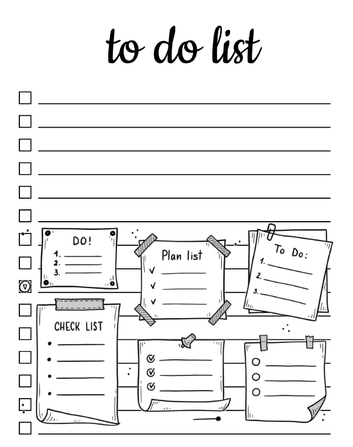

# ToDoList App

    

**ToDoList** - це додаток для управління вашими справами та завданнями. Воно допоможе вам залишатися організованим та стежити за своїми цілями.

## Про додаток

**ToDoList** надає такі можливості:

* **Створення завдань:** Додавайте нові справи з назвами, описами та часом виконання.
* **Редагування завдань:** Змінюйте інформацію про існуючі справи.
* **Отметка виконання:** Позначайте справи як виконані.
* **Встановлення часу:** Задавайте час виконання для справ.
* **Повідомлення:** Отримуйте повідомлення про заплановані завдання.
* **Авторизація:** Авторизуйтесь через email або Google обліковий запис.
* **Збереження:** Всі дані зберігаються в базі даних.

## Архітектура

* **UI (User Interface):** Шар уявлення, що відповідає за взаємодію з користувачем.
* **Domain (Шар Бізнес-Логіки):** Містить основну логіку програми.
* **Data (Шар Даних):** Відповідає за роботу з даними (база даних, API).

## Скріншоти

*Поки тут placeholder, скріншот буде додано після розробки UI.*

## Технології

* **Flutter:** Фреймворк для розробки кросплатформових додатків.
* **Dart:** Мова програмування.
* **Firebase:** Сервіси для авторизації та зберігання даних.

## Getting Started

Ця програма створена за допомогою фреймворку Flutter.

Для запуску проекту вам знадобляться:
-Flutter SDK
-Firebase обліковий запис

* [Lab: Write your first Flutter app](https://docs.flutter.dev/get-started/codelab)
* [Cookbook: Useful Flutter samples](https://docs.flutter.dev/cookbook)

Для допомоги у розробці Flutter додатків скористайтесь:

* [Lab: Write your first Flutter app](https://docs.flutter.dev/get-started/codelab)
* [Cookbook: Useful Flutter samples](https://docs.flutter.dev/cookbook)

Для допомоги з розробкою, перегляньте документацію Flutter:
[online documentation](https://docs.flutter.dev/), у ній є туторіали, приклади тощо.

## Подальший розвиток

Надалі планується:

* Додати покращений UI
* Повідомлення
-Додати інші функції за потребою

## License

MIT license. See the [LICENSE](https://github.com/KsArt-IT/ToDoList-Firebase-Flutter?tab=MIT-1-ov-file) file for details.
